# Palo Alto Firewall Deployment in AWS using Infrastructure as Code (Terraform)

## 📋 Project Overview
This guide provides a detailed walkthrough for deploying a Palo Alto Networks VM-Series firewall in AWS using Terraform.

## 🚀 Prerequisites

### 1. Required Tools
- [✅️] AWS Account
- [ ] Terraform (v1.5.0+)
- [ ] AWS CLI
- [ ] SSH Key Pair


### Architectural Components
- VPC with multiple subnets
- Palo Alto VM-Series Firewall
- Management and Data Interfaces
- Elastic IP Configuration
- Security Groups

## 📂 Project Structure
```
palo-alto-firewall/
│
├── main.tf
├── variables.tf
├── outputs.tf
├── provider.tf
├── network.tf
├── firewall.tf
├── security_groups.tf
└── terraform.tfvars
```

## Initial step

- Login to your AWS account and create a User with programmatic access. Download the CSV file for the access keys and secrets.

- Ensure your User has the required permissions to create the neccessary AWS resorces

- Go to `EC2` instance page and create a new key pair. Save the key pair to your local machine

- grant the key pair the required permissions, use the command below on your terminal
```bash
chmod 400 your-key-pair.pem
```

- Now, go to `AWS MARKETPLACE` and search for `Palo Alto VM-Series Next-Gen Virtual Firewall w/Advanced Threat Prevention (PAYG)`

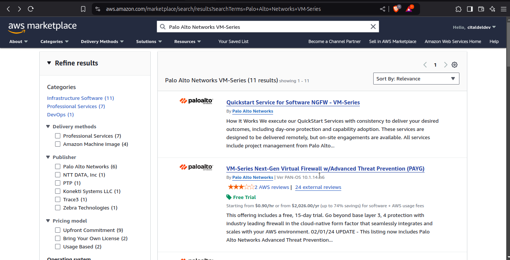

- Select `Palo Alto VM-Series Next-Gen Virtual Firewall w/Advanced Threat Prevention (PAYG)` and click on try for free. then go ahead to subscribe to get a 15-day free trial to use the firewall.

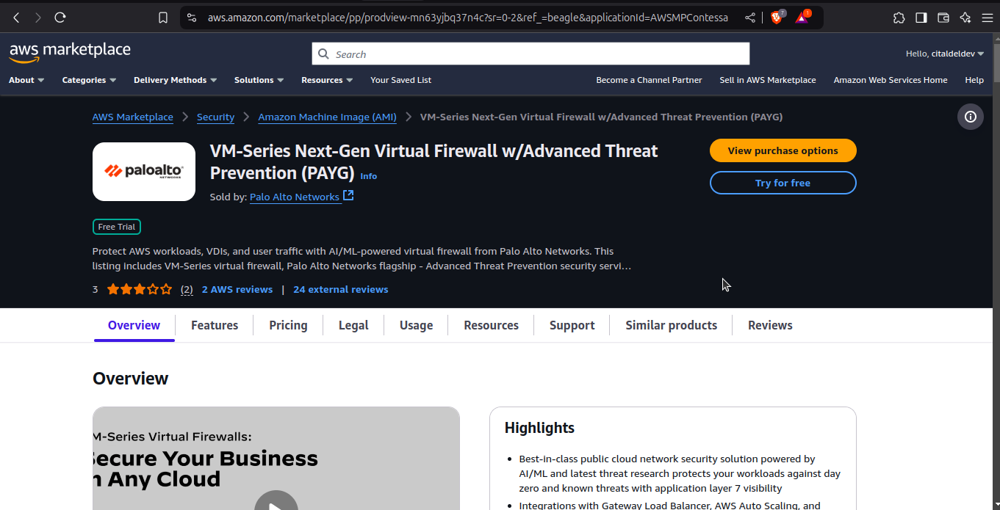

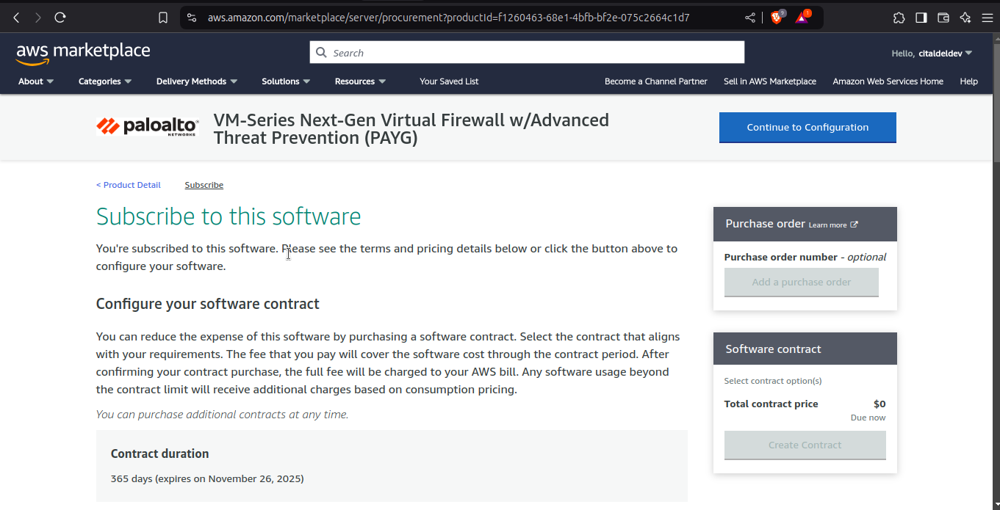

- Wait a bit for it to subscribe, then click on `continue to configuration`

- Set up the configuration by selecting the `AMI type`, `Software Version` and your desired `AWS region`

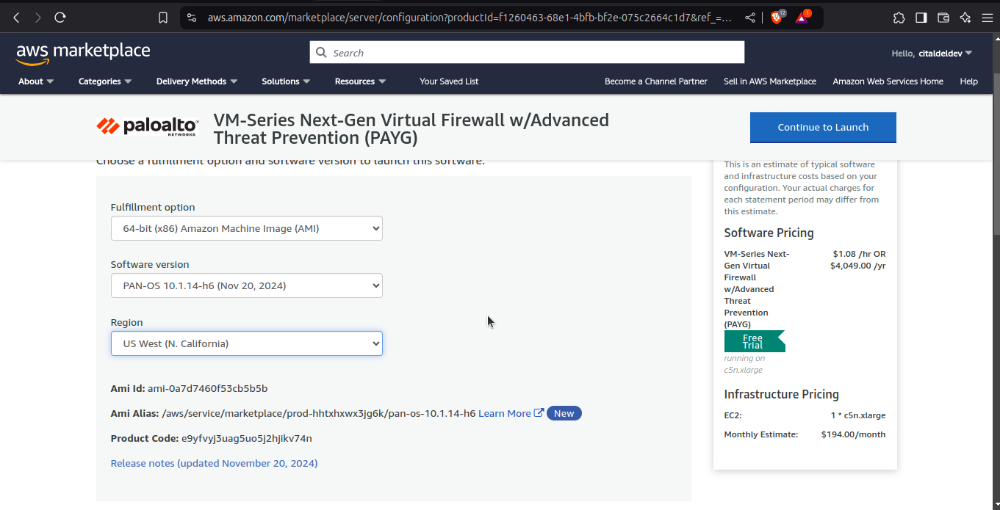

- Finally , Note the `AMI ID` for palo alto firewall

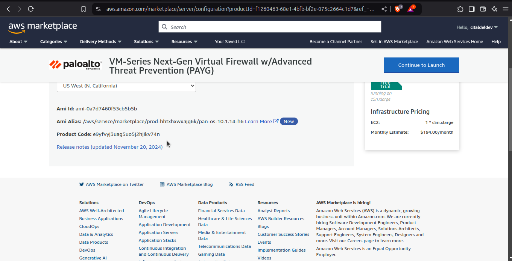

## 🔧 Configuration Steps

### Step 1: AWS Credentials Setup

- `PS`: you need to ensure you already hace the AWS cli installed as well as Terraform in your local machine. if you dont, kindly go through this [AWS docs](https://docs.aws.amazon.com/cli/latest/userguide/cli-chap-install.html) to install CLI and this [Terraform docs](...........) to install terraform


```bash
# Configure AWS CLI
aws configure
# Enter your AWS Access Key ID
# Enter your AWS Secret Access Key
# Enter default region (e.g., us-west-2)
# Enter output format (json)
```
- Create s3 bucket to serve as `backend ` for terraform
```bash
aws s3api create-bucket --bucket palo-alto-unique123 --region us-west-1 --create-bucket-configuration LocationConstraint=us-west-1

```

### Step 2: Terraform Provider Configuration (provider.tf)

```hcl
terraform {
  required_providers {
    aws = {
      source  = "hashicorp/aws"
      version = "~> 5.0"
    }
  }
  
  backend "s3" {
    bucket = "palo-alto-unique123"
    key    = "palo-alto/terraform.tfstate"
    region = "us-west-1"
  }
}

provider "aws" {
  region     = var.aws_region
  access_key = var.aws_access_key
  secret_key = var.aws_secret_key
}
```


### Step 4: Network Configuration (network.tf)

- Now lets configure the infrastructure network part bit by bit

1. `Create a VPC` - This is the main network container for your AWS resources. It provides a virtual networking environment for your resources. inside the netwrok.tf, add the following below

```hcl
resource "aws_vpc" "firewall_vpc" {
  cidr_block           = "10.0.0.0/16"
  enable_dns_hostnames = true
  
  tags = {
    Name = "Palo Alto Firewall VPC"
  }
}
```
2. `Create internet Gateway`- add the following below inside the network.tf

```hcl
resource "aws_internet_gateway" "firewall_igw" {
  vpc_id = aws_vpc.firewall_vpc.id
  
  tags = {
    Name = "Firewall VPC Internet Gateway"
  }
}

```


3. `Create a Subnet` - You can have multiple subnets in a VPC. Add the following below inside the network.tf

```hcl
resource "aws_subnet" "management_subnet" {
  vpc_id                  = aws_vpc.firewall_vpc.id
  cidr_block              = "10.0.1.0/24"
  availability_zone       = "us-west-1c"  
  map_public_ip_on_launch = true

  tags = {
    Name = "Management Subnet"
  }
}

resource "aws_subnet" "data_subnet" {
  vpc_id                  = aws_vpc.firewall_vpc.id
  cidr_block              = "10.0.2.0/24"
  availability_zone       = "us-west-1c" 

  tags = {
    Name = "Data Subnet"
  }
}

```

4. `Create a Route Table` - This is used to determine where traffic should be routed. Also add the following below inside the network.tf

```hcl
# Route Table for Management Subnet
resource "aws_route_table" "management_route_table" {
  vpc_id = aws_vpc.firewall_vpc.id

  route {
    cidr_block = "0.0.0.0/0"
    gateway_id = aws_internet_gateway.firewall_igw.id
  }

  tags = {
    Name = "Management Subnet Route Table"
  }
}

# Route Table for Data Subnet
resource "aws_route_table" "data_route_table" {
  vpc_id = aws_vpc.firewall_vpc.id

  tags = {
    Name = "Data Subnet Route Table"
  }
}

```

5. `Associate the Route Tables with the Subnets` -  Add the following into the network.tf file also

```hcl
resource "aws_route_table_association" "management_subnet_association" {
  subnet_id      = aws_subnet.management_subnet.id
  route_table_id = aws_route_table.management_route_table.id
}

resource "aws_route_table_association" "data_subnet_association" {
  subnet_id      = aws_subnet.data_subnet.id
  route_table_id = aws_route_table.data_route_table.id
}
```
6. `Create Elastic Network Interface for both Management and Data Plane` - Add the following below inside the network.tf


```hcl
resource "aws_network_interface" "management_interface" {
  subnet_id       = aws_subnet.management_subnet.id
  private_ips     = ["10.0.1.10"]  # Static private IP in management subnet
  security_groups = [aws_security_group.firewall_management_sg.id]

  tags = {
    Name = "Palo Alto Management Interface"
  }
}


resource "aws_network_interface" "data_interface" {
  subnet_id   = aws_subnet.data_subnet.id
  private_ips = ["10.0.2.10"]  # Static private IP in data subnet

  tags = {
    Name = "Palo Alto Data Interface"
  }
}

```
7. `Create an Elastic IP for the Management Interface` - Add the following below inside the network.tf

```hcl
resource "aws_eip" "management_eip" {
  domain                    = "vpc"
  depends_on = [aws_instance.palo_alto_firewall]

  network_interface = aws_network_interface.management_interface.id

  tags = {
    Name = "Management Interface Elastic IP"
  }
}
```


### Step 5: Security Group Configuration

Create a security group for the management interface and another for the data interface. These security groups will control the inbound and outbound traffic for each interface
- Create a new file named `security_groups.tf` and add the following code
```hcl
resource "aws_security_group" "firewall_management_sg" {
  name        = "Palo Alto Management SG"
  description = "Security group for Palo Alto firewall management interface"
  vpc_id      = aws_vpc.firewall_vpc.id

  ingress {
    from_port   = 22
    to_port     = 22
    protocol    = "tcp"
    cidr_blocks = ["0.0.0.0/0"]
  }

  ingress {
    from_port   = 443
    to_port     = 443
    protocol    = "tcp"
    cidr_blocks = ["0.0.0.0/0"]
  }

   tags = {
    Name = "Firewall Management Security Group"
  }
}
```
- basically, what we did is to create a security group that allows inbound traffic on port 22 (SSH) and port 443 

### Step 6: Firewall Deployment Configuration

- Create a new file named `firewall.tf` and add the following code
```hcl
resource "aws_instance" "palo_alto_firewall" {
  ami           = var.palo_alto_ami
  instance_type = var.firewall_instance_type
  key_name      = "devops"

  network_interface {
    network_interface_id = aws_network_interface.management_interface.id
    device_index         = 0
  }

  network_interface {
    network_interface_id = aws_network_interface.data_interface.id
    device_index         = 1
  }

  tags = {
    Name = "Palo Alto Firewall"
  }
}
```
- This code creates an AWS instance for the Palo Alto firewall, using the `palo_alto_ami` which we earlier got from AWS marketplace

- We also specify the instance type and key name for the instance

### Step 7: Required Variables

- Create a new file named `variables.tf` and add the following code

```hcl
variable "aws_region" {
  description = "AWS deployment region"
  type        = string
  default     = "us-west-1"
}

variable "aws_access_key" {
  description = "AWS Access Key"
  type        = string
  sensitive   = true
}

variable "aws_secret_key" {
  description = "AWS Secret Key"
  type        = string
  sensitive   = true
}

variable "palo_alto_ami" {
  description = "Palo Alto VM-Series AMI ID"
  type        = string
  
}

variable "firewall_instance_type" {
  description = "EC2 Instance type for Palo Alto Firewall"
  type        = string
  default     = "m5.xlarge"
}
```

- This code defines the required variables for the AWS deployment

- Finally, you can add these into your terraform.tfvars

```hcl
palo_alto_ami = "Replace this with the particular ami you got for palo alto firewall "
aws_access_key = "add your aws access key"
aws_secret_key = "add your aws secret"

```


## 🚀 Deployment Commands

Now, lets deploy our infrastructure

### Initialize Terraform
```bash
terraform init
```
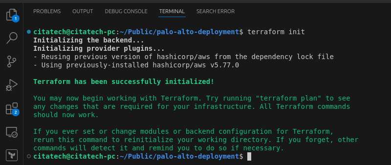

### Validate Configuration
```bash
terraform validate
```
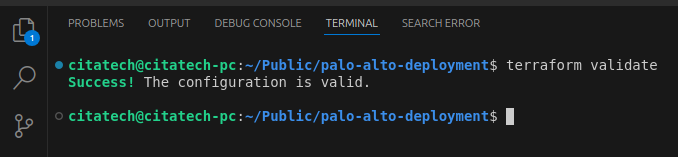

### Plan Deployment
```bash
terraform plan
```
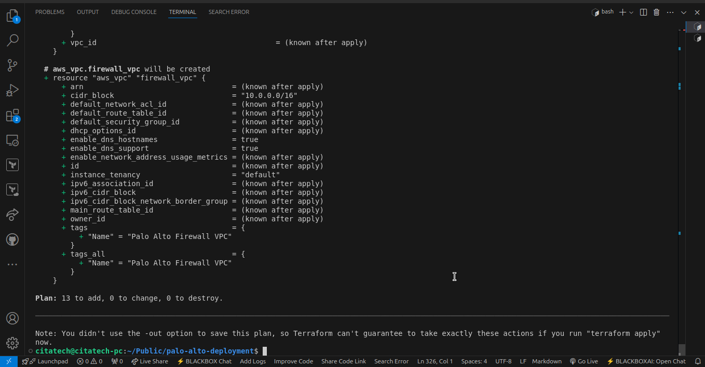

### Apply Configuration
```bash
terraform apply
```
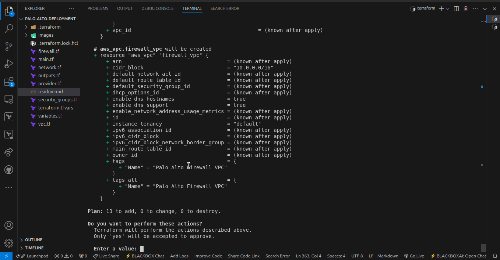

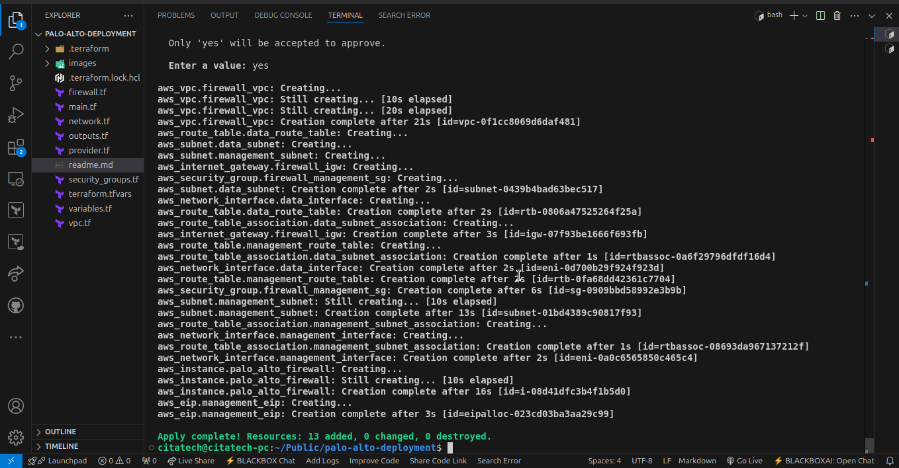

### Confirm Infrastructure has been created 

`VPC`
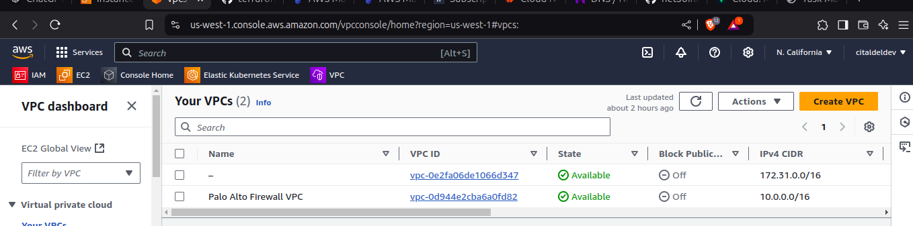

`Subnets`
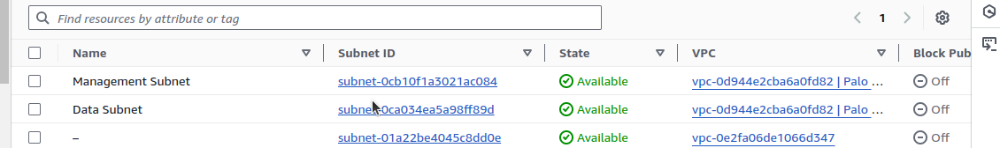

`Route Tables`
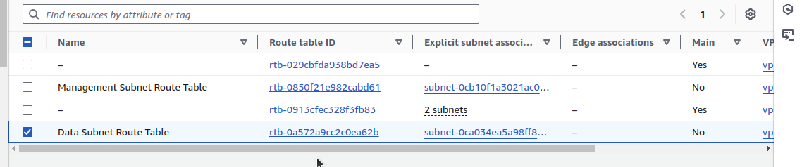

`Internet Gateway`
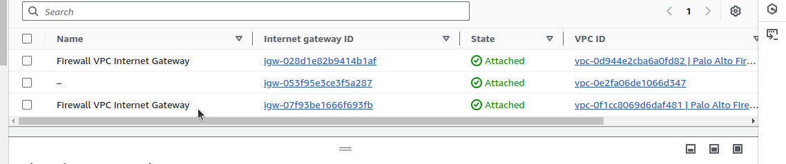

`Elastic IP`
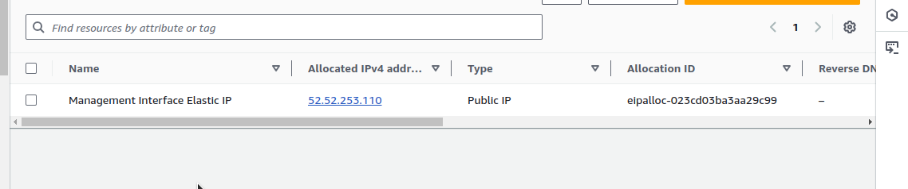

`Security group`
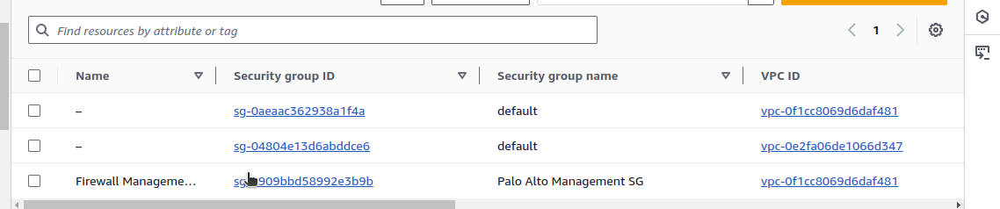

`Palo Alto Firewall VM Instance`
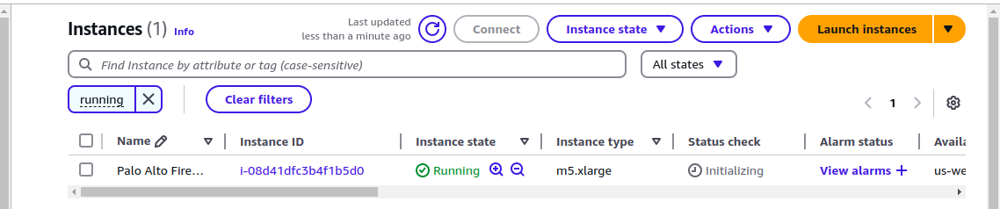

## 🔒 Post-Deployment Access

### SSH into Firewall

- Use the Elastic Ip created in the previous steps to ssh into the Palo Alto Firewall VM instance

```bash
# SSH Connection
ssh -i keypairname.pem admin@elastic-ip
```
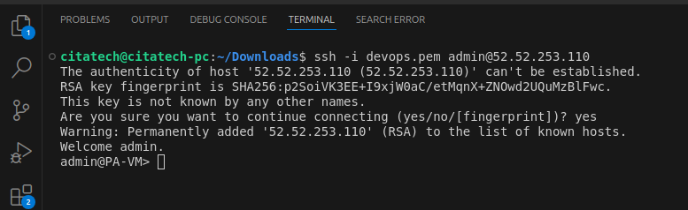

- Configure a new password, using the following command and follow the onscreen prompts

```bash
configure
```

```bash
set mgt-config users admin password
```

- If you have a License that needs to be activated, set the DNS server IP address so that the firewall can aceess the Palo Alto Networks licensing server. Enter the following command to set the DNS server IP address:

```bash
set deviceconfig system dns-setting servers primary <ip_address>
```

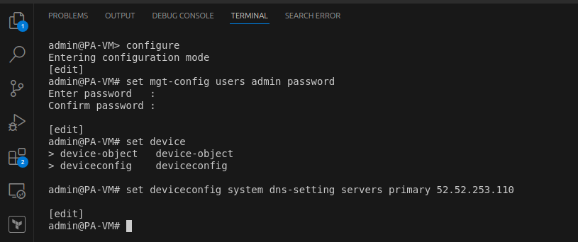


- commit Your changes
```bash
commit
```

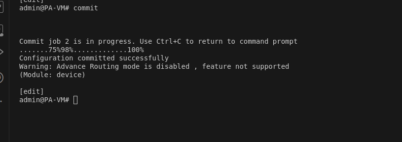


### Finally, Access the web interface using 

`https://<elastic-ip-address>`

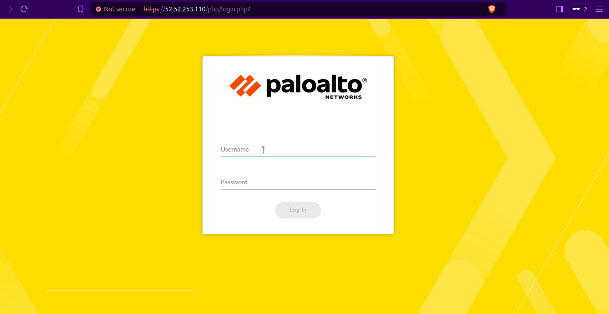

- Login using the user name `admin` and the passowrd which you set earlier

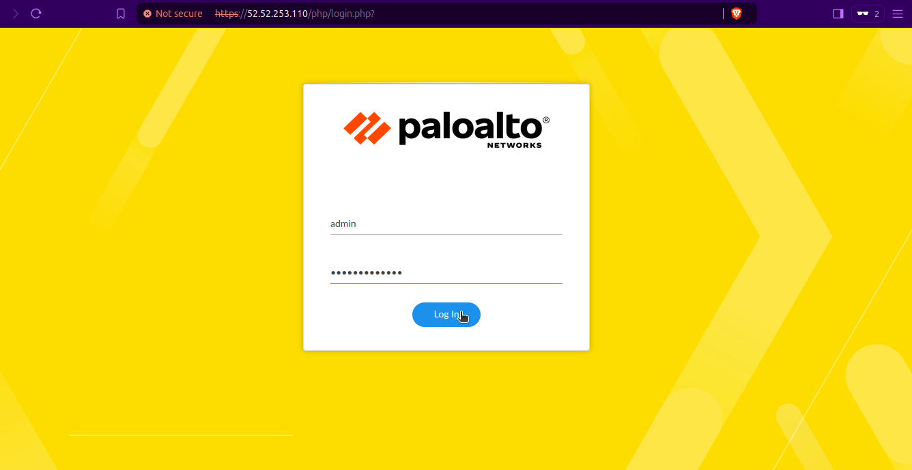

- Now you have gained access into the dashboard of your palo alto firewall

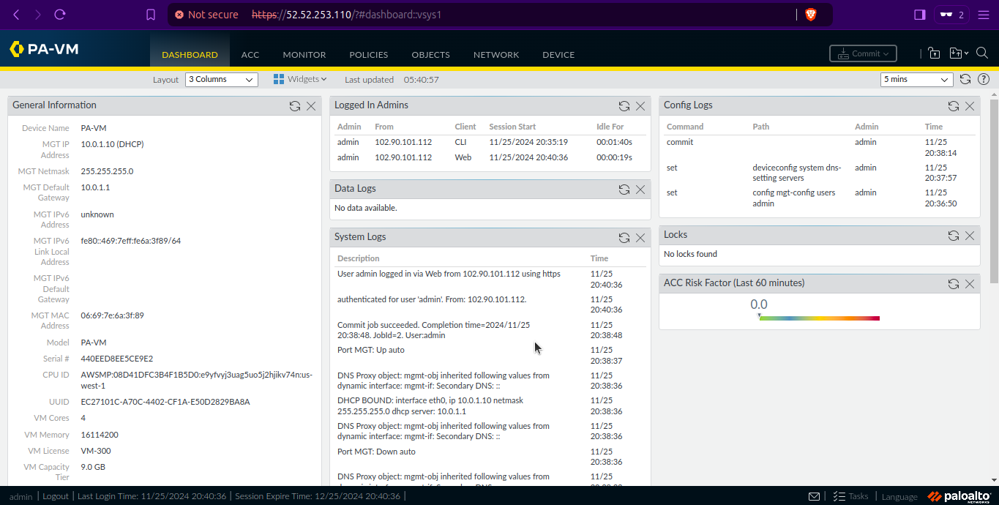

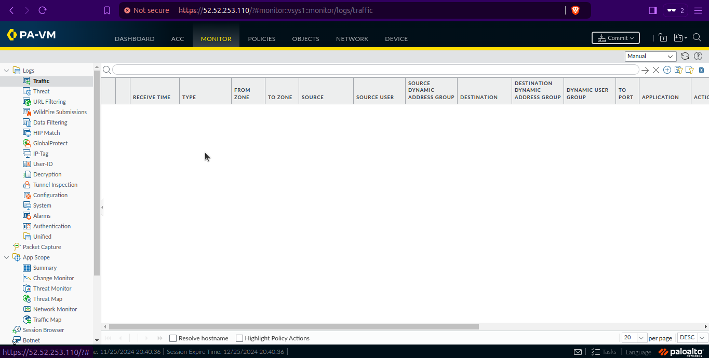

## 🛠️ Troubleshooting

### Common Issues
- [ ] Incorrect AMI ID
- [ ] Network Interface Configuration
- [ ] Security Group Restrictions
- [ ] Subnet CIDR Conflicts

### Verification Checks
```bash
# Verify Instance Status
aws ec2 describe-instances --filters "Name=tag:Name,Values=Palo Alto Firewall"

# Check Network Interfaces
aws ec2 describe-network-interfaces
```


## 📋 Cleanup
```bash
# Destroy Infrastructure
terraform destroy
```

## 🤝 Contributing
1. Fork the repository
2. Create your feature branch
3. Commit your changes
4. Push to the branch
5. Create a new Pull Request


## 📞 Support
For issues, please open a GitHub issue or contact me on [Linkedin-click this button](https://www.linkedin.com/in/chidi-augustine-nwakpa)
